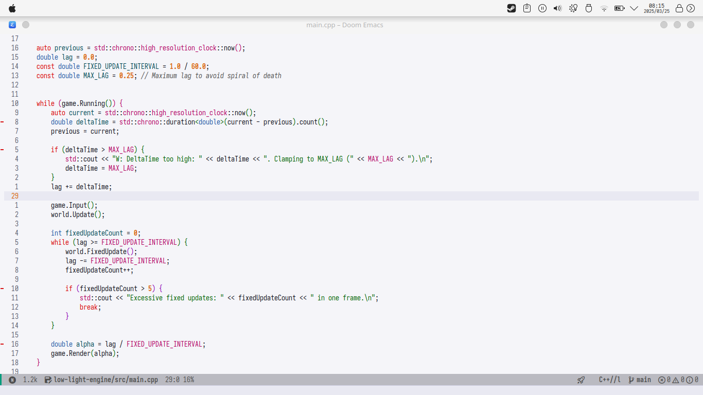

## Install
These configuration files are provided as a reference. Copying them directly into your home directory might have side effects, so review them before applying.

## Backup Script
Manage your dotfiles by running the backup script. This script copies the files and directories declared within it to a dedicated dotfiles backup folder for storage and uploading.

```bash
./backup_script.sh
```


# Doom Emacs Setup 
## Quick Reference

### Todo States

| State | Key | Description |
|-------|-----|-------------|
| TODO | t | Regular task |
| NEXT | n | Active task you're working on |
| WAIT | w | Blocked task waiting on something |
| DONE | d | Completed task |
| RESEARCH | r | Study/research material |
| READ-Later | R | Articles/websites to read |

### Tags

| Tag | Key | Purpose |
|-----|-----|---------|
| #idea | i | Capture insights or new ideas |
| #review | r | Items you want to revisit |
| #security+ | s | Related to Security+ exam |
| #@cs | c | Computer science related |
| #@life | l | Personal life related |

### Important Keybindings

| Keybinding | Description |
|------------|-------------|
| SPC o A | Open main agenda view |
| SPC o i | Show all #idea tags |
| SPC o r | Show all #review tags |
| SPC o s | Show all #security+ tags |
| C-c c t | Capture a TODO item |
| C-c c s | Capture a scheduled item |
| C-c c d | Capture a deadline item |
| C-c c r | Capture a research note |
| C-c c R | Capture a read-later item |
| M-j | Move heading down |
| M-k | Move heading up |

## Common Workflows

### 1. Daily Planning Workflow

1. Start your day with `SPC o A` to view your agenda
2. Check scheduled items for today
3. Identify important tasks and mark them as NEXT (use `t n` in agenda view)
4. When completing tasks, mark them as DONE (use `t d` in agenda view)

### 2. Security+ Study Workflow

#### Capturing Research Notes

1. While studying, use `C-c c r` to capture a research note
2. Enter your note content
3. Add appropriate tags:
   - Add #security+ tag (C-c C-q s)
   - Add #review tag if needed (C-c C-q r)

```
* RESEARCH DHCP Security Considerations
:PROPERTIES:
:CREATED: [2025-05-05 Mon 15:30]
:END:
DHCP snooping is a security feature that acts like a firewall between untrusted hosts and trusted DHCP servers.

Key points:
- Prevents rogue DHCP servers
- Rate-limits DHCP traffic
- Creates binding table to track IP-to-MAC mappings
```

#### Capturing Ideas During Study

1. When you have an insight, use `C-c c r` to capture a research note
2. Add the #idea tag (C-c C-q i)

```
* RESEARCH Connection between DHCP Snooping and ARP inspection
:PROPERTIES:
:CREATED: [2025-05-05 Mon 16:15]
:END:
#idea

DHCP snooping's binding table can be leveraged by DAI (Dynamic ARP Inspection) to validate ARP packets. This creates a layered security approach.
```

### 3. Reading List Management

#### Capturing Articles to Read Later

1. When you find an interesting article, use `C-c c R`
2. Enter the article title and URL
3. Add appropriate tags

```
* READ-Later Understanding Zero Trust Architecture
:PROPERTIES:
:CREATED: [2025-05-05 Mon 17:20]
:END:
URL: https://example.com/zero-trust-architecture
#security+
```

#### Finding and Reading Your Reading List

1. Access your reading list with `SPC o A` (see Reading List section)
2. After reading, mark as DONE (t d)
3. Optionally, create a research note with key takeaways

### 4. Adding Inline Ideas in Code

#### Method 1: Using Code Comments with Special Markers

```python
# IDEA: Implement caching to improve performance
def fetch_data():
    # Current implementation
    pass
```

```rust
// REVIEW: Consider using a more efficient algorithm
fn process_data() {
    // Current implementation
}
```

Then find these later with:
- `SPC / IDEA:` (search project for IDEA markers)
- `SPC / REVIEW:` (search project for REVIEW markers)

#### Method 2: Using Org-Mode's Inline Tasks

In an org file with your code blocks:

```org
/** 
* Code implementation
*/

***** IDEA Implement better error handling
:PROPERTIES:
:CREATED: [2025-05-05 Mon 10:30]
:END:
Need to improve error handling in the authentication module.
***** END

// More code here
```

### 5. Quick Tag-Based Filtering

When you want to:
- Review all your ideas: `SPC o i`
- Find items marked for review: `SPC o r`
- See all Security+ related notes: `SPC o s`

### 6. Project Planning with Org Mode

1. Create a heading for your project in tasks.org
2. Add TODO sub-items for each step
3. Schedule or add deadlines as needed

```org
* Project: Build Security Lab
** TODO Set up virtual machine
   SCHEDULED: <2025-05-10 Sat>
** TODO Install Kali Linux
** TODO Configure network isolation
   DEADLINE: <2025-05-15 Thu>
```

## File Structure

Your Org system uses the following files:

- `tasks.org` - Regular TODO tasks
- `study.org` - Research notes (primarily for Security+)
- `readings.org` - Articles and websites to read later

## Tips and Tricks

### 1. Quick Tagging

When in an Org file:
1. Place cursor on heading
2. Press `C-c C-q`
3. Type the tag's shortcut key (i, r, s, c, or l)

### 2. Task Priority

Set task priority with `C-c ,` followed by:
- A (high priority)
- B (medium priority)
- C (low priority)

### 3. Fast TODO State Changes

When on a heading:
- `C-c C-t` then type the state shortcut (t, n, w, d, r, R)

### 4. Creating Structured Notes

Use Org's built-in structure:
```org
* Main Topic
** Sub-topic
*** Detail
    Content goes here
```

### 5. Including Code in Research Notes

Use code blocks in your research notes:
```org
* RESEARCH Secure Coding Practices
#+begin_src python
def sanitize_input(user_input):
    # Remove potential SQL injection characters
    return re.sub(r'[\'";]', '', user_input)
#+end_src
```

## Customization

If you need to modify your setup:
- Edit the configuration in your Doom Emacs config
- Reload with `SPC h r r` (Doom reload)

## Maintenance

Periodically:
1. Archive completed tasks (C-c C-x C-a)
2. Review open items with `SPC o A`
3. Review tagged items with `SPC o i`, `SPC o r`, `SPC o s`

---
