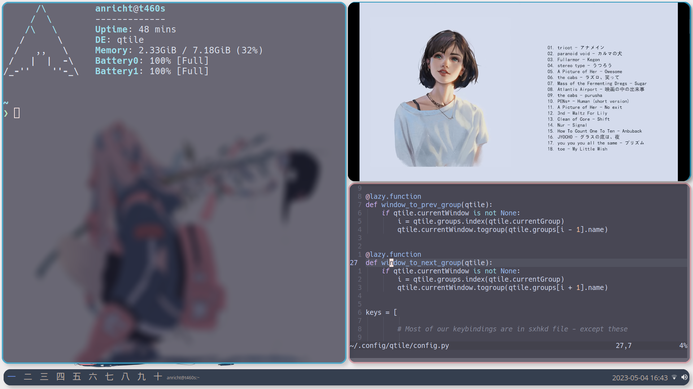
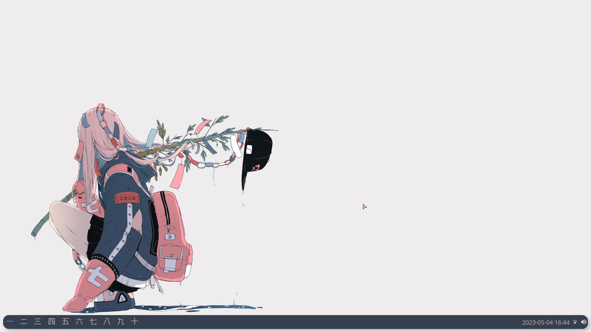

# Specs:
* OS: Arch Linux
* WM: Qtile
* Machine: Thinkpad T460s

# Extra info:
* App launcher handled by [rofi applets](https://github.com/adi1090x/rofi)
* My group names are in Japanese but this is easily changed in config.py
* My wallpaper and rofi image are included in the repo
* Submit issues with questions or indeed any issues (Keep in mind this config should not be copy pasted)

